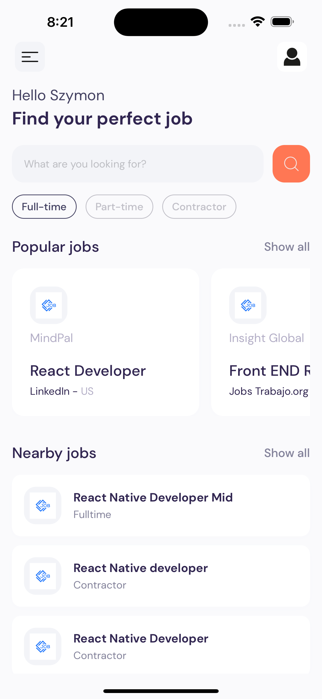

# React Native Jobs App

#### Job Discovery

- Display an assortment of in-demand job openings based on their popularity as well as proximity to the user's location.
- Offer a robust search functionality that allows users to locate job openings by entering specific criteria like job title, company name, or skills required.
- Enable users to refine their job search through an array of filters such as industry, experience level, salary range, employment type, and geographical area.

#### Job Details

- Present detailed information about each job opening, including the role, company, and location, in a well-organized format.
- Include a dedicated section that provides an overview of the job, detailing what the role entails and what the work environment is like.
- Outline the essential and preferred qualifications for applicants, such as educational background, professional experience, and skill sets.
- Detail the specific tasks and obligations that the job role involves, helping prospective candidates understand what will be expected of them.

## Preview

  
  
  
  

